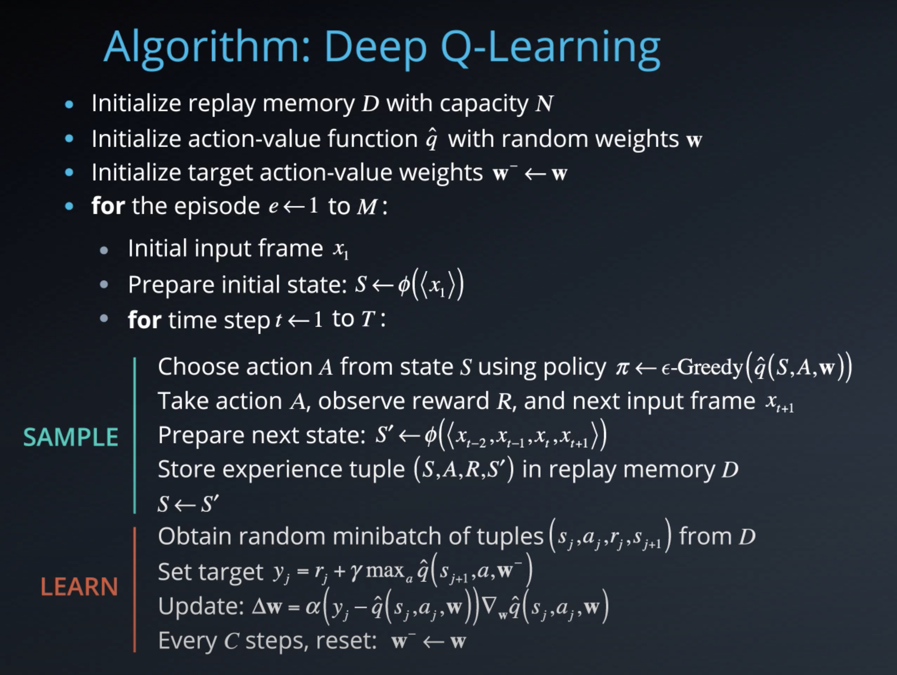
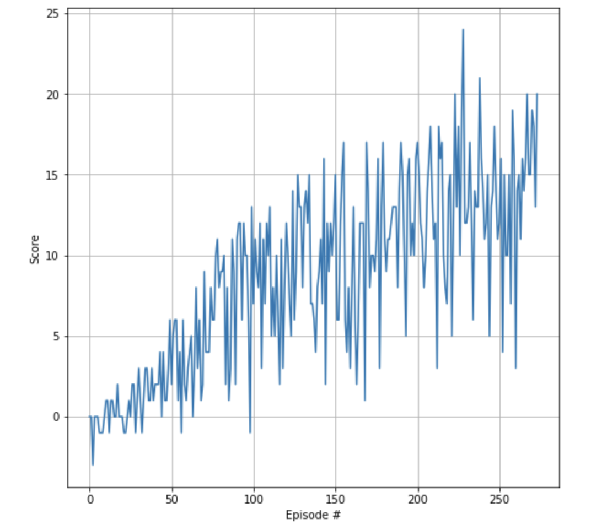

# Summary 

In this project I implemeted an agent to collect as many yellow bananas as possible and avoid the blue bananas in the given virtual environment.
As training algorithm a vanila Value Based DQN is used. 
To solve the task the agent must get an average score of +13 over 100 consecutive episodes.


# Implementation

## Algorithm



This algorithm screenshot is taken from the [Deep Reinforcement Learning Nanodegree course](https://www.udacity.com/course/deep-reinforcement-learning-nanodegree--nd893). 
Please read also the original paper to [DQN](https://storage.googleapis.com/deepmind-media/dqn/DQNNaturePaper.pdf) for more information. 

## Q-network architecture
 Current implementation of Q-network uses a dense neural network with two hidden layers where each layer has 64 nodes with rectified linear unit activation function. The complete architecture is as follows:

Input: 37 nodes (state size)
Hidden layer 1: 64 nodes
Batch normalization
Rectified linear unit activation
Hidden layer 2: 64 nodes
Rectified linear unit activation
Output layer: 4 nodes (number of actions)

Parameters used in DQN algorithm:

Maximum steps per episode: 1000
Starting epsilion: 0.5
Ending epsilion: 0.01
Epsilion decay rate: 0.98

BUFFER_SIZE = 100000    # replay buffer size
BATCH_SIZE = 64         # minibatch size
GAMMA = 0.99            # d iscount factor
TAU = 0.001             # for soft update of target parameters
LR = 0.0001             # learning rate 
UPDATE_EVERY = 4 

## Results



```
Episode 50	Average Score: 0.868
Episode 100	Average Score: 3.35
Episode 150	Average Score: 7.51
Episode 200	Average Score: 9.92
Episode 250	Average Score: 11.96
Episode 274	Average Score: 13.06
Environment solved in 174 episodes!	Average Score: 13.06

Total time took for training: 4.21 min.
 ```
# Possible extensions 

1. Extensive hyperparameter optimization
2. Double Deep Q Networks
3. Prioritized Experience Replay
4. Dueling Deep Q Networks
5. RAINBOW Paper
6. Learning from pixels

# Trained Model 

The module `agent.py` contains functions to store and load the parameters of a trained deep neural network and Adam optimizer. Please use the content of the file Test.ipynb to load the parameters of trained network and optimizer and to test the agent. 
